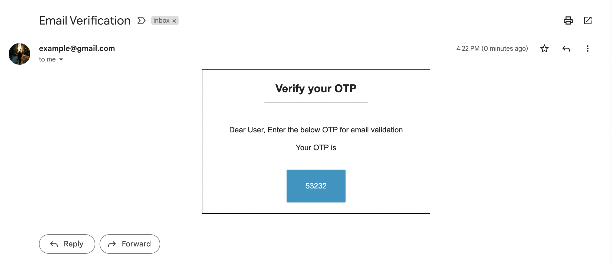

# OTP_VERIFY

## Description

A Module that allows nodejs to send and verify otp through user emails. This module serves for usecases like signup email verification, User identification, Payment Confirmations.
The otp sent is a random 5 digit number. The user receives the otp through email like shown in the image below.

<h1 align="center">
	<br>
	<br>
	
	<br>
	<br>
	<br>
</h1>

## Functions

- setupSenderEmail()
- sendOTP()

## Function Description

### 1. setupSenderEmail(options)

This function is used to setup email that is used to send otp through mail, i.e, sender email.
An options object is passed as argument to the function.
Key-Value pairs that can be sent in options are
| Key | Description |
| :---: | :------------------------------------ |
| `service` | Email service provider |
| `user` | Email id |
| `pass` | Password|

#### setupSenderEmail() function

```js
otp_verify.setupSenderEmail({
  service: "gmail",
  user: "example@gmail.com",
  //for gmail, create an app password and use it
  pass: "app_password",
});
```

### 2. sendOTP(options, callback_function)

This function is used to send otp through emails.
Callback function is called at the end of the function.
Key-Value pairs that can be sent in options are
| Key | Description |
| :---: | :------------------------------------ |
| `to` | Email id of receiver |
| `message` |Message to be sent along with the otp (Optional)|
| `subject` | Subject of the email (Optional) |

#### sendOTP() function

```js
otp_verify.sendOTP(
  {
    to: "xyz@gmail.com",
    message: "Enter the below OTP for email validation",
    subject: "Email Verification",
  },
  (err, otp) => {
    if (err) console.log(err);
    else console.log("Email sent", otp);
  }
);
```

## Usage

#### Example code to send otp through email using Node.js.

```js
const otp_verify = require("otp-verify");

otp_verify.setupSenderEmail({
  service: "gmail",
  user: "example@gmail.com",
  //for gmail, create an app password and use it
  pass: "app_password",
});

otp_verify.sendOTP(
  {
    to: "xyz@gmail.com",
    message: "Enter the below OTP for email validation",
    subject: "Email Verification",
  },
  (err, otp) => {
    if (err) console.log(err);
    else console.log("Email sent", otp);
  }
);
```

## Issues

#### Gmail

When using gmail, we need to give app password in the setupSenderEmail() function. If you find difficulty in creating an app password, follow these steps

- Go to your Google account at https://myaccount.google.com/
- Go to Security
- In "Signing in to Google" section choose 2-Step Verification - here you have to verify yourself, in my case it was with phone number and a confirmation code send as text message. After that you will be able to enabled 2-Step Verification
- Back to Security in "Signing in to Google" section choose App passwords
- From the Select app drop down choose Other (Custom name) and put a name e.g. nodemailer
- A modal dialog will appear with the password. Get that password and use it in your code.

Read more about it [here](https://nodemailer.com/usage/using-gmail/)

#### Hotmail/Outlook

If the mail is not being sent, once check the inbox for any confirmations to be done.
